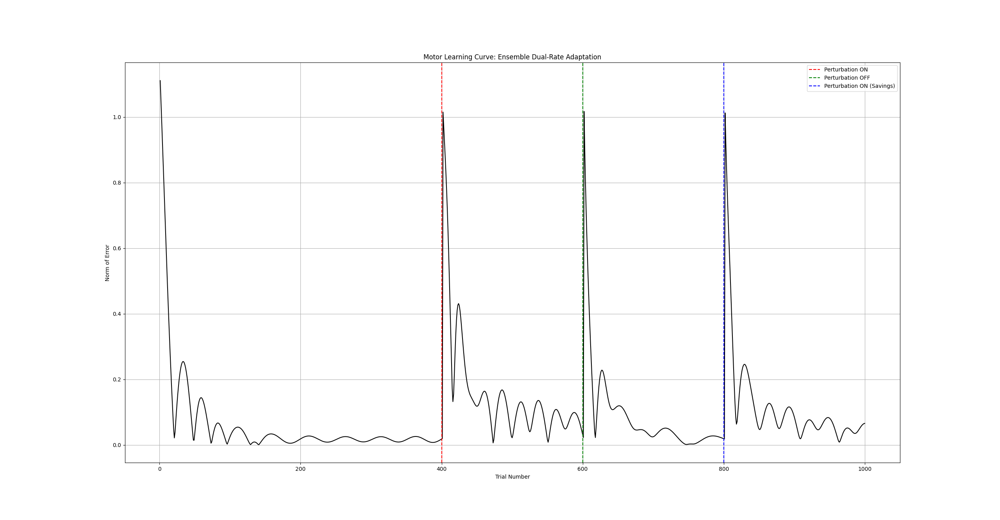
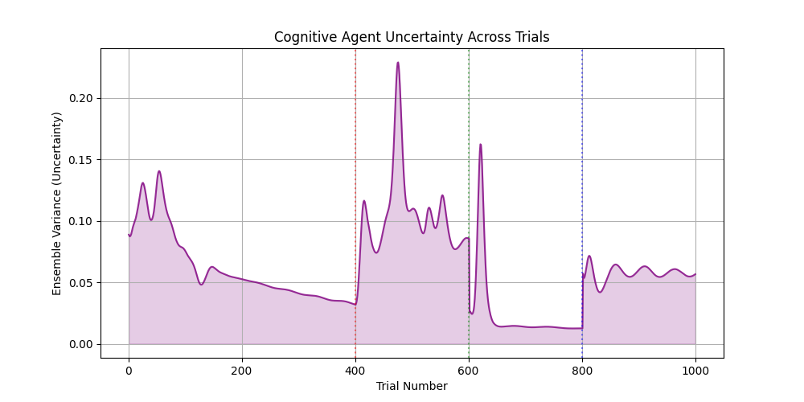
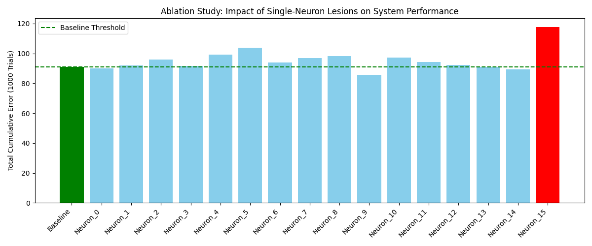
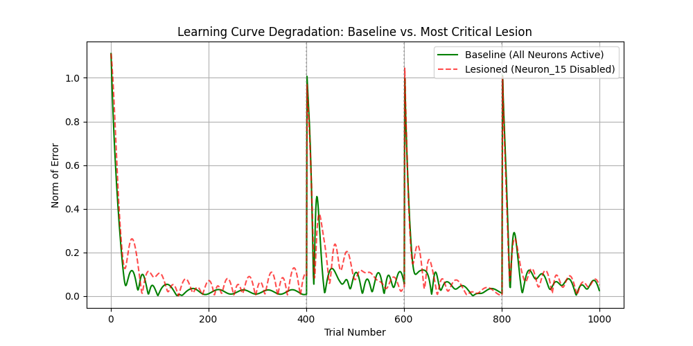
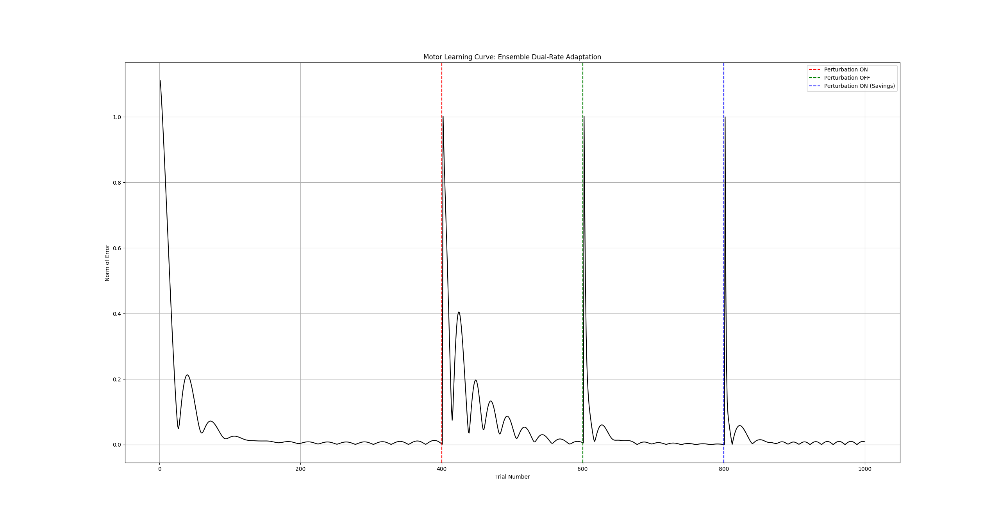

# ENDR-ILC: Ensemble Neural Dual-Rate Iterative Learning Control

[](https://www.python.org/)
[](https://pytorch.org/)
[](https://mujoco.org/)
[](https://opensource.org/licenses/MIT)

**Official repository for: "Simulation Studies for Understanding Human Motor Learning in Unstructured Environments"**

## 📖 Overview

Human sensorimotor adaptation relies on a dual-rate mechanism: a "fast process" utilizing explicit cognitive strategies for rapid adaptation, and a "slow process" governed by implicit cerebellar motor memory for long-term retention. 

This repository implements the **Ensemble Neural Dual-Rate ILC (ENDR-ILC)** framework. By structurally fusing classical Iterative Learning Control (ILC) with modern deep learning (Bootstrapped Neural Ensembles), this architecture resolves the cognitive inflexibility of classical control and the structural brittleness of isolated neural networks.

Evaluated on a 2-Degree-of-Freedom (2-DOF) robotic manipulator within the MuJoCo physics engine, the framework successfully replicates critical biological phenomena, including the **washout aftereffect**, **motor savings**, and the real-time evaluation of **environmental uncertainty**.

---

## 🏗️ Architecture

The ENDR-ILC framework consists of two parallel agents operating on distinct temporal scales, integrated via a strict biological attention gate:

1. **The Implicit Agent (Classical Slow ILC):** A first-order, Q-filtered ILC acting as a perfect mathematical integrator across the iteration domain to cancel persistent gravitational forces without steady-state error.
2. **The Explicit Agent (Bootstrapped Neural Ensemble):** A committee of $N=5$ independent Multi-Layer Perceptrons (MLPs). Each agent features a heavily bottlenecked architecture ($2 \rightarrow 16 \rightarrow 2$) yielding exactly 82 parameters to prevent overfitting and ensure microsecond execution.

---

## 🧮 Mathematical Formulation

### Plant Dynamics
The physical plant is a 2-DOF planar manipulator governed by the standard rigid-body equation of motion:
$$M(\theta)\ddot{\theta} + C(\theta, \dot{\theta})\dot{\theta} + G(\theta) = \tau + \tau_{ext}$$
*Where $\tau_{ext}$ represents unstructured environmental perturbations (e.g., a $-1$ N.m force).*

### The Fast Process (Explicit Cognitive Agent)
Each agent $i$ maps the spatial error to a compensatory torque utilizing stochastic weight initialization and a non-linear ReLU activation:
$$U_{fast,i}(t) = \text{ReLU}(E(t) \cdot W_{1,i} + B_{1,i}) \cdot W_{2,i} + B_{2,i}$$
Outputs are aggregated to filter transient noise:
$$U_{fast\_mean}(t) = \frac{1}{N} \sum_{i=1}^{N} U_{fast,i}(t)$$

### The Slow Process (Implicit Motor Agent)
The feedforward torque trajectory is updated trial-to-trial:
$$U_{slow, j+1}(t) = Q(q) \left[ U_{slow, j}(t) \right] + L(q) \left[ E_{j+1}(t) \right]$$
* **Retention Factor ($Q = 1.0$):** Enforces perfect mathematical integration.
* **Learning Gain ($L = 0.05$):** Yields slow, exponential adaptation characteristics.

### Attention Gate Integration
The total control signal applied to the MuJoCo plant:
$$U_{total}(t) = \alpha \cdot U_{fast\_mean}(t) + (1 - \alpha) \cdot U_{slow}(t)$$
*The attention gate is strictly bounded at $\alpha = 0.1$, forcing the implicit system to perform 90% of the mechanical work to prevent error starvation.*

### Cognitive Uncertainty Quantification
Environmental stochasticity is quantified in real-time by extracting the variance across the bootstrapped ensemble predictions:
$$\sigma^2(t) = \frac{1}{N} \sum_{i=1}^{N} \left( U_{fast, i}(t) - U_{fast\_mean}(t) \right)^2$$

---
## 🏆 Key Empirical Results & Successful Findings

The ENDR-ILC framework was rigorously evaluated against biological hallmarks of sensorimotor adaptation. The following findings validate the model's ability to fuse explicit cognitive strategies with implicit motor memory.

### 1. The ENDR-ILC Architecture
<p align="center">
  
</p>
*Figure 1: The proposed architecture bifurcating spatial error into the Explicit Cognitive Ensemble (Fast) and the Implicit Cerebellar ILC (Slow), modulated by an attention gate ($\alpha=0.1$).*

### 2. Replication of Biological Motor Learning (The Dual-Rate Model)
The framework successfully replicates the classic biological dual-rate learning curve over a 1000-trial episodic reaching task.

<p align="center">
  
</p>

* **Adaptation (Trial 401):** When a $-1$ N.m perturbation is introduced, the spatial error spikes but is rapidly suppressed by the fast cognitive ensemble, followed by slow, exponential ILC convergence.
* **The Washout Aftereffect (Trial 601):** Upon abrupt removal of the perturbation, the system exhibits a negative error spike. This physically proves the framework did not merely react to error, but synthesized a predictive **internal forward model**.
* **Motor Savings (Trial 801):** When the perturbation is reintroduced, the readaptation gradient is significantly steeper. The system exhibits biological "savings," confirming the successful retention of the implicit memory trace.

### 3. Quantifying Cognitive Uncertainty
By utilizing a bootstrapped ensemble of $N=5$ agents, the framework extracts real-time environmental uncertainty without the computational overhead of Bayesian networks.

<p align="center">
  
</p>

* **Environmental Surprise:** The massive variance spike at Trial 400 mathematically flags that the independent agents disagree on the optimal strategy when faced with a novel perturbation.
* **Cognitive Confidence:** As the internal model converges, uncertainty decays. Crucially, the variance spike during Readaptation (Trial 800) is heavily muted, proving the ensemble successfully recalled the perturbation mapping.

### 4. Deconstructing the "Black Box": Structural Ablation
To diagnose the structural brittleness of single-network controllers, a single-neuron mathematical ablation study ($Mask = 0.0$) was executed on the explicit ensemble.

<p align="center">
  
  
</p>

* **Functional Localization:** The study revealed that the backpropagation algorithm heavily weights a singular, "load-bearing" node within the hidden layer to manage the explicit strategy.
* **Resolving Brittleness:** Lesioning this critical neuron catastrophically lobotomizes the fast process (red dashed line). This finding empirically justifies our use of **Bootstrapped Ensembles**, which forces structural redundancy and protects the physical plant from singular nodal failures.

### 5. Failure State Analysis: The Necessity of Passive Forgetting
<p align="center">
  
</p>

To prove the necessity of biological decay rates, L2 Regularization was disabled (`weight_decay = 0.0`). Without passive forgetting, the network suffered **catastrophic interference**. During the Washout phase, the networks violently overwrote their synaptic weights, completely destroying the implicit memory trace and nullifying the "savings" effect during readaptation.

---

## 📊 Key Empirical Findings

* **Biological Replication:** The framework successfully simulates the classic dual-rate learning curve over 1000 discrete trials, perfectly capturing initial adaptation, the washout aftereffect, and accelerated readaptation (savings).
* **Deconstructing the "Black Box":** A single-neuron structural ablation study revealed extreme functional localization. The backpropagation algorithm heavily weights a singular node; lesioning this critical neuron mathematically lobotomizes the fast process, empirically justifying the need for ensemble redundancy.
* **Ablation of Passive Forgetting:** Disabling L2 regularization (`weight_decay = 0.0`) induces catastrophic interference. The neural ensemble violently overwrites synaptic weights during washout, permanently destroying the memory trace and nullifying motor savings.
* **Sensitivity Analysis:** Artificial edge-cases (e.g., Cognitive Over-Trust at $\alpha = 0.8$ and Cerebellar Ataxia at $\lambda = 0.85$) result in severe kinematic underdamping and baseline collapse, validating the framework's optimal hyperparameters.

---

## 🚀 Getting Started

### Prerequisites
* Python 3.8+
* PyTorch 2.0+
* MuJoCo (Multi-Joint dynamics with Contact)

### Installation
Clone the repository and install the required dependencies:
```bash
git clone [https://github.com/22Pravin/Sensory_Prediction_HML.git](https://github.com/22Pravin/Sensory_Prediction_HML.git)
cd Sensory_Prediction_HML
pip install -r requirements.txt
```
---

### Usage

Execute the primary 1000-trial episodic simulation (Baseline $\rightarrow$ Adaptation $\rightarrow$ Washout $\rightarrow$ Readaptation):

```bashpython
run_simulation.py
```
To run the structural ablation diagnostics:
```bashpython
scripts/ablation_study.py
```

---

### 📄 Citation

If you utilize this framework or findings in your research, please consider citing:
Code snippet
```bash
@article{gohil2026endr,
  title={Simulation Studies for Understanding Human Motor Learning in Unstructured Environments},
  author={Gohil, Pravinkumar},
  institution={Dhirubhai Ambani University},
  year={2026}
}
```
---
